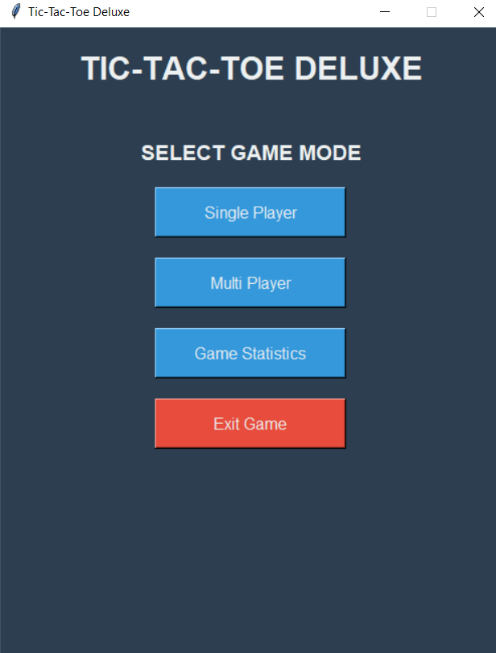
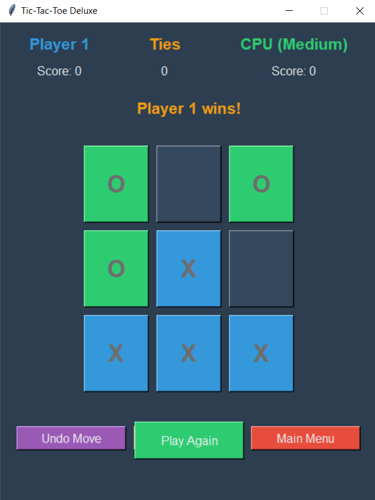

# Tic-Tac-Toe Deluxe

A modern implementation of the classic Tic-Tac-Toe game with a sleek UI built using Python and Tkinter.

## 🎮 Features
- **Single Player Mode**: Play against an AI with three difficulty levels
- **Multiplayer Mode**: Play against a friend on the same device
- **Game Statistics**: Track your performance over time
- **Customizable Player Names**: Personalize your gaming experience
- **Undo Move**: Made a mistake? You can take back your last move
- **Game History**: Keep track of past games and outcomes

## 📸 Screenshots
<div align="center">
    
    
</div>

## 🧠 AI Opponent
The game features three different difficulty levels:
- **Easy**: Makes completely random moves
- **Medium**: Mix of random moves and strategic ones
- **Hard**: Uses strategic algorithm to make the best possible moves

## ⚙️ Setup
1. Prerequisites:
   - Python 3.6+

2. Installation:
   ```bash
   # Clone repository
   git clone https://github.com/yourusername/Tic-Tac-Toe-Deluxe.git
   cd Tic-Tac-Toe-Deluxe

   # Install dependencies (if needed)
   pip install -r requirements.txt

   # Run the game
   python "tic tac toe.py"
   ```

## 📌 How to Play
1. Start by selecting game mode (Single Player or Multiplayer)
2. If Single Player, select difficulty level
3. Enter player names
4. Click on the board to make your move
5. Use the "Undo Move" button if you want to take back a move
6. Reset the board or return to main menu when done

## 🎯 Gameplay Controls
- **Left Click**: Make a move
- **Undo Button**: Take back the last move (or last two moves in single player)
- **Reset Board**: Start a new game with the same settings
- **Main Menu**: Return to the main menu

## 🛠️ Tech Stack
- Python
- Tkinter
- JSON (for saving statistics)

## 🧪 Future Improvements
- Network multiplayer functionality
- Customizable board sizes (4x4, 5x5)
- Themes and sound effects
- More advanced AI using minimax algorithm with alpha-beta pruning

## 📄 License
MIT License

## 📞 Contact
- Email: dataversaiesolutions@gmail.com
- LinkedIn: @sahilthorat

<div align="center">
<p>Made with ❤️ for game lovers everywhere</p>
<p>⭐ Star this repository if you found it fun to play! ⭐</p>
</div>